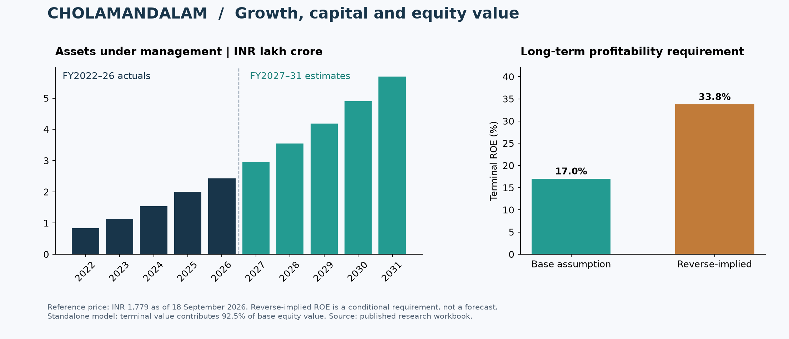

# Cholamandalam Finance Equity Research

**How much equity investment does a growing lender need, and what profitability would support its market price?**

Standalone model for Cholamandalam Investment and Finance Company Limited: FY2022–FY2026 actuals, FY2027–FY2031 forecasts, three financial statements, equity DCF and reverse DCF. Amounts are in INR crore unless stated otherwise.

## Results at a glance

| Measure | Base case |
|---|---:|
| Valuation date | 18 September 2026 |
| Reference share price | ₹1,779.00 |
| FCFE value per share | ₹776.15 |
| Cost of equity / terminal growth | 13% / 5% |
| Base terminal ROE | 17% |
| Terminal ROE implied by reference price | 33.8% |

The reverse DCF solves for terminal ROE while holding the explicit forecast and other valuation assumptions constant. It reprices to ₹1,779; it is an implied expectation, not management guidance or a forecast. Terminal value accounts for approximately 92.5% of base-case value, making the conclusion particularly sensitive to long-term assumptions.

## Explore the research

- **[Download the Excel model](https://github.com/keyurmarolia/cholamandalam-finance-equity-research/raw/refs/heads/main/model/Cholamandalam_Finance_Equity_Research.xlsx)** — start with `00_Cover`, then `05_Assumptions`, `10_DCF` and `11_Reverse_DCF`.
- **[Read the model review](research/Model_Review.md)** — publication checks, reconciliations and interpretation limits.
- **[View the source register](data/source_register.csv)** — company annual reports, presentations and transcripts.

Open the downloaded workbook in Microsoft Excel. The saved base case can be reviewed without installing code or downloading the original source reports.

## Operating assumptions

| Driver | Model treatment | Basis |
|---|---|---|
| AUM growth | 22% in FY2027; fades to 16% by FY2031 | July 2026 management commentary of 22%–23%; later years are analyst estimates |
| Net income margin, including fees | 8.0% | May 2026 management commentary; held flat as an analyst assumption thereafter |
| Operating expenses, including depreciation | 3.05% of model average assets | Midpoint of management's 3.0%–3.1% commentary |
| Credit costs | 1.5% of model average assets | Management commentary; no subsequent improvement assumed |
| Funding cost | 7.5% in FY2027; 7.6% thereafter | FY2026 MDA and broadly flat FY2027 commentary; later buffer is an estimate |
| Required book equity | 14% of net loans | Analyst capital-intensity assumption close to FY2026; not regulatory CAR |

The margin, operating-cost and credit-cost assumptions share one asset denominator and imply a 3.45% pre-tax return, close to management's approximately 3.5% outlook. The denominator is a proxy calibrated from FY2026 reported net income and margin, then held proportional to average net loans. It is not balance-sheet total assets. Interest income is derived consistently with the selected net income margin and funding costs; these are not independent margin forecasts.

## Model structure

1. **Sources and raw financials:** audited standalone figures and disclosed operating metrics.
2. **Historical analysis and industry context:** growth, margins, asset quality and the rationale for assumptions.
3. **Assumptions and schedules:** loans, earnings, equity retention, CCD conversion and funding.
4. **Income statement, balance sheet and cash flow:** linked statements with balance-sheet and cash reconciliation.
5. **DCF and reverse DCF:** equity value and market-implied terminal profitability.

For a lender, borrowings are operating funding. FCFE is calculated as PAT less the increase in required book equity; debt is not deducted again from equity value. Terminal FCFE uses required equity multiplied by terminal ROE less terminal growth. The model includes the remaining ₹630 crore CCD conversion and estimated dilution, using the contractual floor less the maximum discount.

Blue numbers are hardcoded inputs, green numbers link to another worksheet, and black numbers are same-sheet calculations. Negative numbers use brackets. Management commentary and analyst estimates are distinguished in the assumption notes.

## Sources and limitations

The [source register](data/source_register.csv) links to company annual reports, presentations and earnings-call transcripts. FY2026 MDA and May/July 2026 calls inform the operating assumptions. Screener supplies a secondary comparison and the dated reference price. Original third-party reports are not redistributed here.

This is an aggregate standalone model, not a product-level credit-risk or regulatory-capital model. Other assets and liabilities retain historical ratios; the cash-flow bridge uses aggregate balance movements and maintenance investment equal to depreciation. It is a simplified cash-flow presentation, not a forecast statutory classification. The first forecast year's FCFE is prorated from the valuation date. CCD conversion prices are estimated, and no excess-capital value is added. Discount rate, terminal growth and terminal ROE are analyst assumptions, not company guidance.

Balance-sheet and cash reconciliations, historical PAT, funding and equity roll-forwards, an independent valuation calculation, reverse-DCF repricing and selected assumption sensitivities were checked. Financial forecasts remain estimates; this project is not an investment recommendation.

## Related projects

- [Pricol equity research](https://github.com/keyurmarolia/pricol-equity-research)
- [InterGlobe Aviation equity research](https://github.com/keyurmarolia/interglobe-aviation-equity-research-model)
- [IFRS 9 mortgage ECL](https://github.com/keyurmarolia/ifrs9-mortgage-ecl)
- [Basel credit capital](https://github.com/keyurmarolia/basel-credit-capital-engine)
- [FRTB market risk](https://github.com/keyurmarolia/frtb-market-risk-engine)
- [Momentum in Indian equities](https://github.com/keyurmarolia/momentum-in-indian-equities-research)
